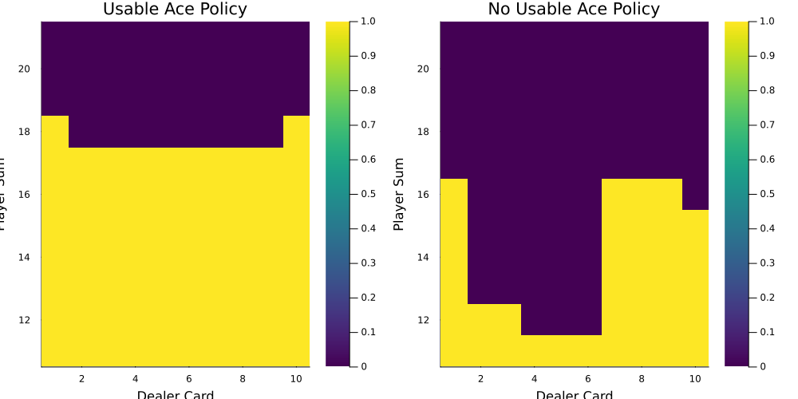
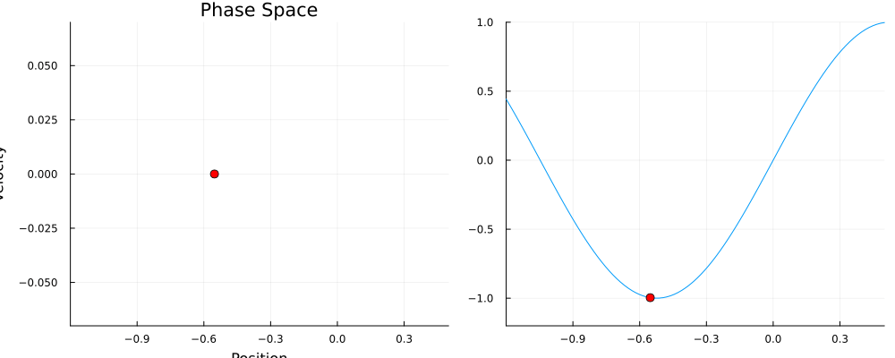
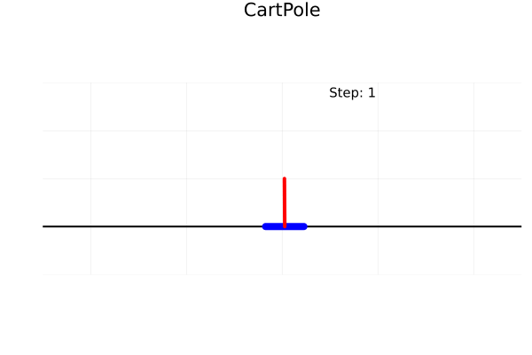

# Reinforcement Learning Algorithms with Julia

This repository contains implementations of various reinforcement learning algorithms written in Julia. The algorithms are organized into different categories, including tabular methods, function approximation, policy gradient methods, and reference implementations.

### Directories and Files

- **`function_approx/`**: Contains implementations of reinforcement learning algorithms using function approximation techniques.

  - `FA_mountaincar.jl`: Semi-gradient SARSA for the Mountain Car environment.
  - `FA_randomwalk.jl`: Gradient Monte Carlo for a random walk environment.

- **`policy_gradient/`**: Implements policy gradient methods.

  - `PO_cartpole.jl`: REINFORCE algorithm for the CartPole environment.
  - `PO_withbaseline_cartpole.jl`: REINFORCE with baseline for the CartPole environment.

- **`tabular/`**: Implements tabular reinforcement learning methods.
  - `DP_comparison.jl`: Comparison of value iteration and policy iteration.
  - `DP_gambler.jl`: Value iteration for the gambler's problem.
  - `MC_control_blackjack.jl`: Monte Carlo control for Blackjack.
  - `MC_prediction_blackjack.jl`: Monte Carlo prediction for Blackjack.
  - `TD_prediction_blackjack.jl`: Temporal difference prediction for Blackjack.

## Requirements

The following Julia packages are used:

- `Plots`
- `Flux`
- `ReinforcementLearning`
- `Statistics`
- `Distributions`
- `Zygote`
- `Random`
- `OffsetArrays`

## Usage

Each `.jl` file is a standalone script that can be executed to run the corresponding algorithm.

## Visualizations

### Tabular Methods - Blackjack

### Function Approximation - Mountain Car

### Policy Gradient - CartPole

